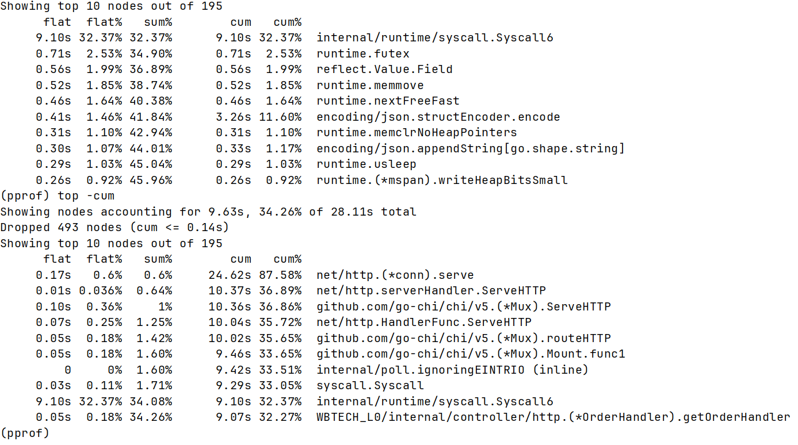
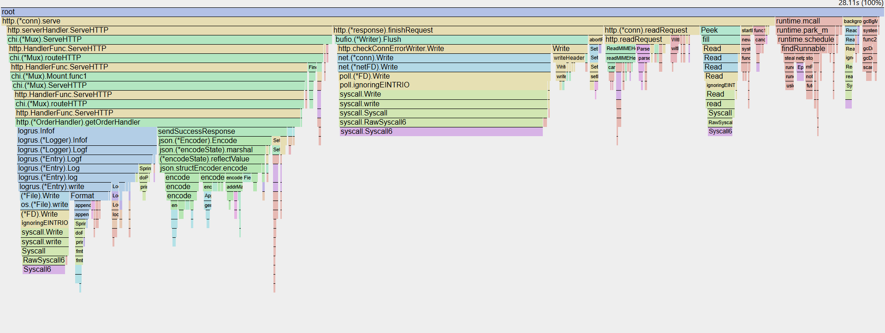
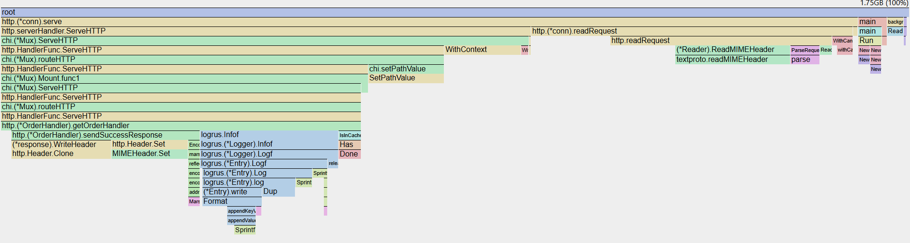
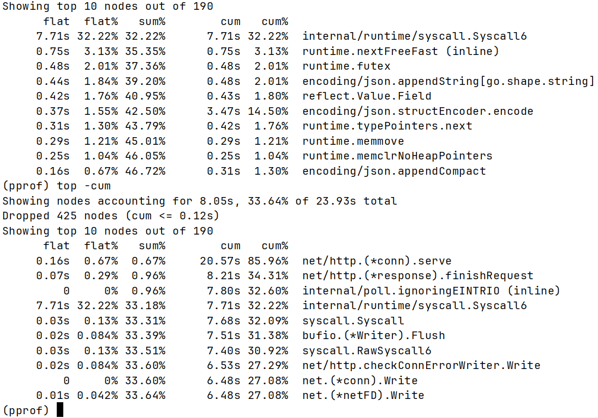
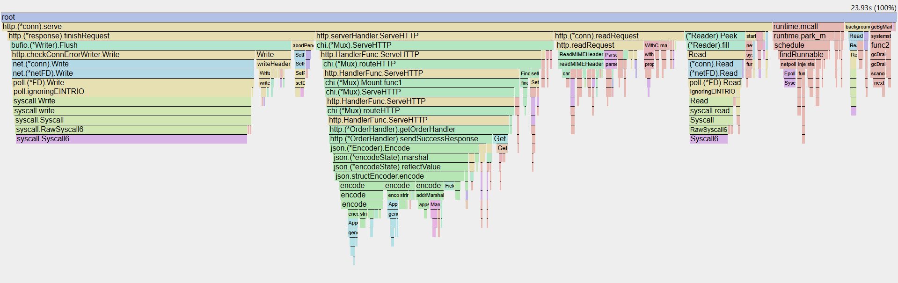
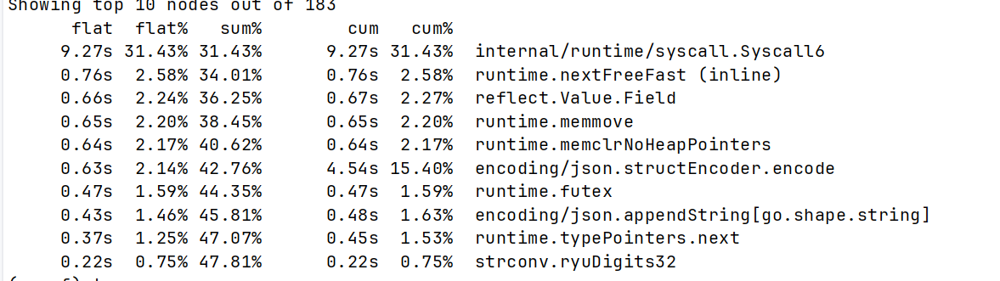

## Как снимал cpu профиль?

```shell
curl "http://localhost:6060/debug/pprof/profile?seconds=30" > cpu.prof
```
Создал нагрузку
```shell
hey -z 30s -c 50 http://localhost:8081/order/{random_id_from_logs}
```

Смотрим
```shell
go tool pprof cpu.prof
```
+
```shell
go tool pprof -http=:8082 cpu.prof
```

Из top видно что очень много съедает  Syscall и encoder.
net и chi возможно тоже можно оптимизировать, они тоже занимают много, но сейчас можно отпимизировать logrus + encoder.



А из flamegraph становится понятно что это Logrus вызывает syscall, и так же видно encoder



По памяти видно что очень много съедает logrus



## 1-я Оптимизация это удалить Logrus из handler 

Он нужен для того, чтобы показать, что заказ берётся из кэша



Handler пропал из топ 10

А так же из flamegraph пропал logrus только сеть осталась + encoding



## 2-я оптимизация это добавить sync.Pool к json/encoder
Так же можно совсем заменить json-encoder на bytedance-sonic

sync.Pool только ухудшил картину

