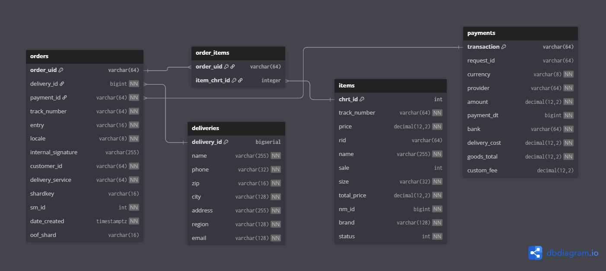

# Видео

https://disk.yandex.ru/i/-jLHz2zvnkhdpg

## Запуск сервиса

### Шаг 1: Создание `.env` файла
Создайте файл `.env` в корневой директории проекта с указанным содержимым.

```bash
SERVER_ADDR=0.0.0.0
SERVER_PORT=8081

POSTGRES_HOST=db
POSTGRES_PORT=5432
POSTGRES_USER=user
POSTGRES_PASSWORD=12345
POSTGRES_DB=postgres_db
POSTGRES_SSLMODE=disable

KAFKA_HOST=kafka
KAFKA_HEALTHCHECK_HOST=kafka
KAFKA_PORT=29092
KAFKA_HEALTHCHECK_TOPIC=__consumer_offsets
KAFKA_TOPIC=orders
KAFKA_GROUP_ID=order-service
```

### Шаг 2: Загрузка переменных окружения
Загрузите переменные окружения в текущую сессию.

```bash
source .env
```

### Шаг 3: Запуск сервиса
#### Вариант 1: Использование Makefile (рекомендуется)

```bash
# запуск сервисов с логами
make up-with-logs
# без логов
make up
```

#### Вариант 2:  Docker Compose

```bash
# запуск всех сервисов
docker compose up -d

# с пересборкой 
docker compose up --build -d
```

#### Запуск тестов 

```bash
make mocks

go test -v ./internal/usecases/service/ -run TestOrderService

# или make
make tests
```


### Доступ к сервисам
- Приложение: [http://localhost:8081](http://localhost:8081)
- Kafka UI: [http://localhost:9020](http://localhost:9020)
- PostgreSQL: `localhost:5432`

## Схема базы данных 





