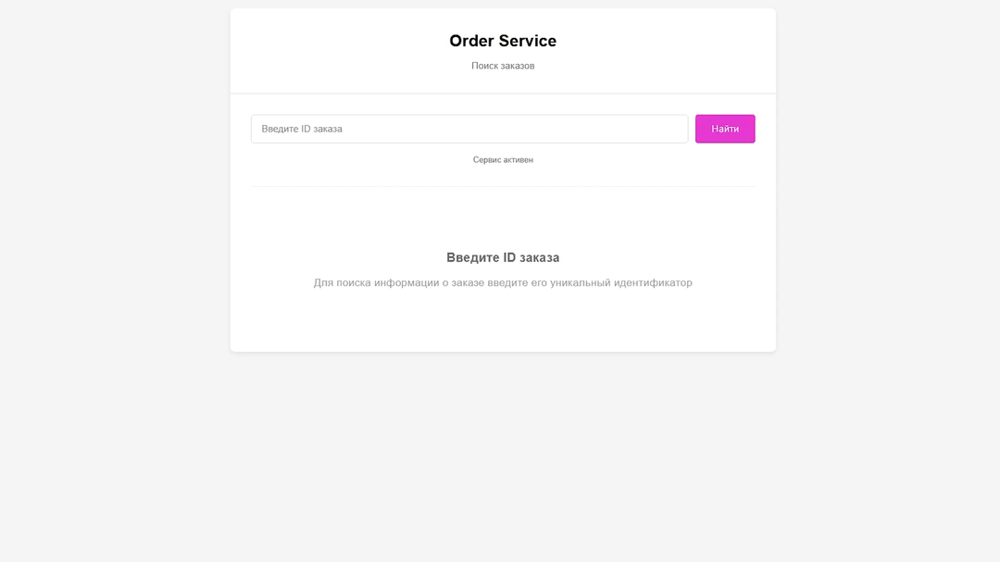
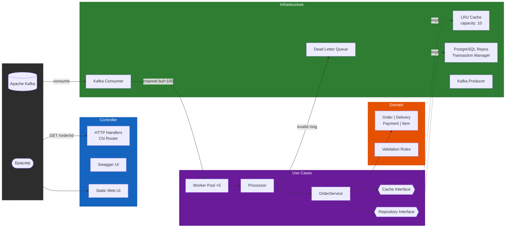
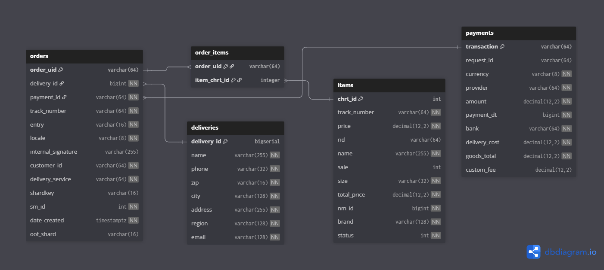

# Сервис обработки заказов

Микросервис для обработки потока заказов в реальном времени с использованием Kafka, PostgreSQL и in-memory LRU-кэша.



## Демо

[Полное демо на Яндекс Диске](https://disk.yandex.ru/i/-jLHz2zvnkhdpg)

## Технологии

| Категория | Стек |
|-----------|------|
| Язык | Go 1.24 |
| API | Chi, Swagger |
| Брокер сообщений | Apache Kafka |
| База данных | PostgreSQL 17 |
| Кэш | LRU (собственная реализация) |
| Инфраструктура | Docker, Docker Compose |
| Тестирование | go test, mockery |


### Clean Architecture


```mermaid
graph LR
    subgraph external [" "]
        direction TB
        CLIENT([Браузер])
        KAFKA[(Apache Kafka)]
    end

    subgraph controller ["Controller"]
        direction TB
        H["HTTP Handlers<br/>Chi Router"]
        SW["Swagger UI"]
        WEB["Static Web UI"]
    end

    subgraph usecases ["Use Cases"]
        direction TB
        S["OrderService"]
        P["Processor"]
        W["Worker Pool ×5"]
        CI{{"Cache Interface"}}
        RI{{"Repository Interface"}}
    end

    subgraph domain ["Domain"]
        direction TB
        E["Order | Delivery<br/>Payment | Item"]
        V["Validation Rules"]
    end

    subgraph infra ["Infrastructure"]
        direction TB
        LC["LRU Cache<br/>capacity: 10"]
        R["PostgreSQL Repos<br/>Transaction Manager"]
        KF["Kafka Consumer"]
        KP["Kafka Producer"]
        DLQ["Dead Letter Queue"]
    end

    CLIENT -->|GET /order/id| H
    CLIENT --> WEB
    KAFKA -->|consume| KF
    KF -->|channel buf=100| W
    W --> P
    P --> S
    S --> E
    S --> CI
    S --> RI
    CI -.->|impl| LC
    RI -.->|impl| R
    P -->|invalid msg| DLQ

    style external fill:#2d2d2d,stroke:#555,stroke-dasharray:5,color:#fff
    style controller fill:#1565c0,stroke:#0d47a1,color:#fff
    style usecases fill:#6a1b9a,stroke:#4a148c,color:#fff
    style domain fill:#e65100,stroke:#bf360c,color:#fff
    style infra fill:#2e7d32,stroke:#1b5e20,color:#fff
```


## Структура проекта

```
├── cmd/app/                  # Точка входа
├── config/                   # Конфигурация
├── internal/
│   ├── app/                  # Инициализация приложения
│   ├── domain/               # Бизнес-сущности
│   ├── usecases/
│   │   ├── service/          # OrderService + workers + processor
│   │   └── kafka/            # Генератор тестовых заказов
│   ├── controller/http/      # HTTP handlers
│   ├── infrastructure/
│   │   ├── cache/            # LRU-кэш
│   │   ├── kafka/            # Consumer, Producer, DLQ
│   │   └── repository/       # PostgreSQL репозитории
│   └── mocks/                # Моки для тестов
├── migrations/               # SQL-миграции (Goose)
├── static/                   # Веб-интерфейс (HTML/CSS/JS)
├── docs/                     # Swagger
├── docker-compose.yml
├── Dockerfile
└── makefile
```

## Схема базы данных



## Запуск сервиса

### Шаг 1: Создание `.env` файла
Создайте файл `.env` в корневой директории проекта с указанным содержимым.

```bash
SERVER_ADDR=0.0.0.0
SERVER_PORT=8081

POSTGRES_HOST=db
POSTGRES_PORT=5432
POSTGRES_USER=user
POSTGRES_PASSWORD=12345
POSTGRES_DB=postgres_db
POSTGRES_SSLMODE=disable

KAFKA_HOST=kafka
KAFKA_HEALTHCHECK_HOST=kafka
KAFKA_PORT=29092
KAFKA_HEALTHCHECK_TOPIC=__consumer_offsets
KAFKA_TOPIC=orders
KAFKA_GROUP_ID=order-service
```

### Шаг 2: Загрузка переменных окружения
Загрузите переменные окружения в текущую сессию.

```bash
source .env
```

### Шаг 3: Запуск сервиса
#### Вариант 1: Использование Makefile (рекомендуется)

```bash
# запуск сервисов с логами
make up-with-logs
# без логов
make up
```

#### Вариант 2:  Docker Compose

```bash
# запуск всех сервисов
docker compose up -d

# с пересборкой
docker compose up --build -d
```

#### Запуск тестов

```bash
make mocks

go test -v ./internal/usecases/service/ -run TestOrderService

# или make
make tests
```

### Доступ к сервисам

| Сервис | URL | Порт |
|--------|-----|------|
| Приложение | [http://localhost:8081](http://localhost:8081) | 8081 |
| Swagger | [http://localhost:8081/swagger/](http://localhost:8081/swagger/) | 8081 |
| Kafka UI | [http://localhost:9020](http://localhost:9020) | 9020 |
| PostgreSQL | `localhost` | 5432 |
